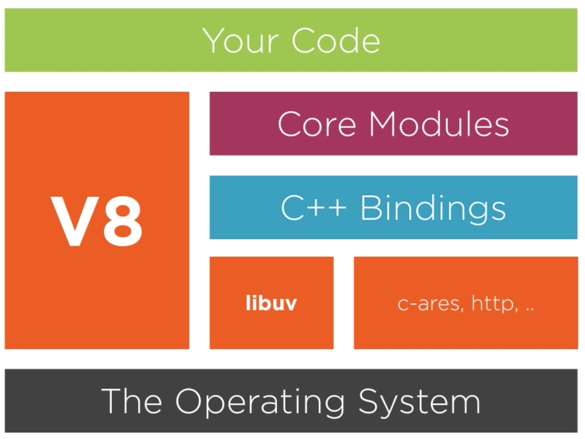

# Node VM
Node uses Virtual machine (VM) and by default it uses `V8`.

# How to check VM version?
`process` module has API to read the VM version. Following is API to read V8 version.
`process.versions.v8`

You can use it as below.
1. As a command line
Simply run `node -p 'process.versions.v8'` to print the version of `v8`
2. As node REPL
Start REPL by run following
`process.versions.v8`
3. In your node.js code for example v8.js file
`console.log(process.version.v8)`
Note: `process` is a global module therefore no need to require it separately.

# Why do I care about V8 version?
Javascript feature supported by `nodejs` is really a javascript version shipped with `V8`.
That's why its important to know the `V8` version so that you can write more native Javascript code.

# What are V8 feature groups?
## Shipping
These features are on by default.
## Staged
Its not by default enabled. However can be enable by command line as below. Staged features are almost complete but not finalized yet.

```node --harmony -p "Node.padEnd(8, '*')"```

Following are staged feature for Node `v9.11.1`
```
 nodejs-v8 node --v8-options | grep "staged"
  --future (Implies all staged features that we want to ship in the not-too-far future)
```
## In Progress
Its not by default enabled. However can be enable by command line as below. In progress features are still in progress.

```node --harmony_trailing_commas -p 'function tc(a,b,){}'```

You can check all the in-progress feature by running following command.

```node --v8-options | grep "in progress"```
Following is output for node `v9.11.1`
```
  --harmony_array_prototype_values (enable "harmony Array.prototype.values" (in progress))
  --harmony_function_sent (enable "harmony function.sent" (in progress))
  --harmony_do_expressions (enable "harmony do-expressions" (in progress))
  --harmony_class_fields (enable "harmony public fields in class literals" (in progress))
  --harmony_promise_finally (enable "harmony Promise.prototype.finally" (in progress))
  --harmony_number_format_to_parts (enable "Intl.NumberFormat.prototype.formatToParts" (in progress))
  --harmony_plural_rules (enable "Intl.PluralRules" (in progress))
```

# Look for all the V8 options?
```
node --v8-options
```

# V8 module
`v8` module is not a global module. You need to explicitly require it before use it.

Following are few good methods provided by `v8` module

## v8.getHeapStatistics()
It prints current heap statics. Following is sample output.
```
{
  total_heap_size: 7684096,
  total_heap_size_executable: 3670016,
  total_physical_size: 6141264,
  total_available_size: 1491808776,
  used_heap_size: 4997800,
  heap_size_limit: 1501560832,
  malloced_memory: 8192,
  peak_malloced_memory: 1172712,
  does_zap_garbage: 0
 }
```

## v8.getHeapSpaceStatistics()
It prints current heap space statics. Following is sample output.
```
[ { space_name: 'new_space',
    space_size: 2097152,
    space_used_size: 994040,
    space_available_size: 37128,
    physical_space_size: 2002336 },
  { space_name: 'old_space',
    space_size: 2945024,
    space_used_size: 2402032,
    space_available_size: 656,
    physical_space_size: 2454256 },
  { space_name: 'code_space',
    space_size: 2097152,
    space_used_size: 1222304,
    space_available_size: 0,
    physical_space_size: 1287840 },
  { space_name: 'map_space',
    space_size: 544768,
    space_used_size: 379544,
    space_available_size: 0,
    physical_space_size: 396952 },
  { space_name: 'large_object_space',
    space_size: 0,
    space_used_size: 0,
    space_available_size: 1491770880,
    physical_space_size: 0 } ]

```
Please note; following are segments which makes V8 heap spaces
1. new_space
2. old_space
3. code_space
4. map_space
5. large_object_space

## v8.cachedDataVersionTag()
This used to determine CPU feature based on v8 version flag.

# How node interact with V8?
Node uses V8 C++ API to interact with. Following is node.js design to use V8.



